# Execute Command Job Manual

In this Execute Command Job sample application, it receives command from the AWS IoT Jobs service, execute the command on the device by invoking it in a *system()* call. The command can be anything that “*system()*” call accepts. To demonstrate OTA download, we will specify a “*curl*” command that downloads a file from AWS Simple Storage Service (S3).

## Prerequisites

1. You have AWS credentials to access the [AWS Console](https://console.aws.amazon.com/).
2. You have installed the [AWS Command Line Interface (CLI)](https://aws.amazon.com/cli/), and can execute commands.

## Step 1 - Upload a file to AWS S3

First, create a S3 bucket.

Go to [AWS S3 console](https://console.aws.amazon.com/s3). Select **“Create bucket”**

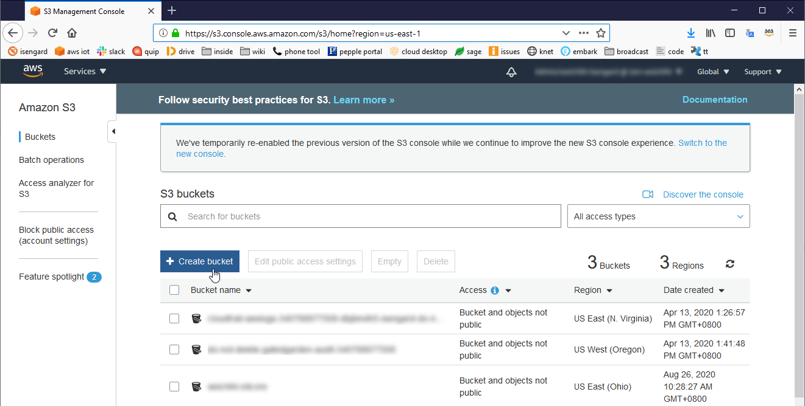

Fill in bucket name, for example, “my-iot-bucket”. Choose the same region as the IoT Core that you’ve used earlier. Select **“Next”**, **“Next”**, **“Next”**, then **“Create bucket”**.

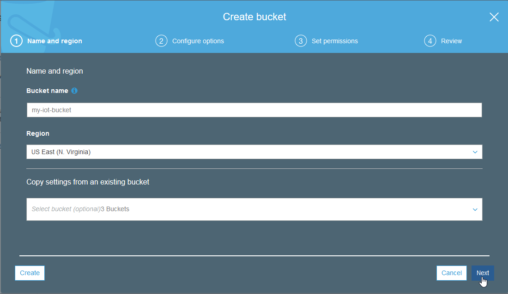

Select the bucket we just created.

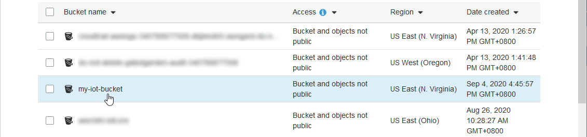

Select “Upload”.

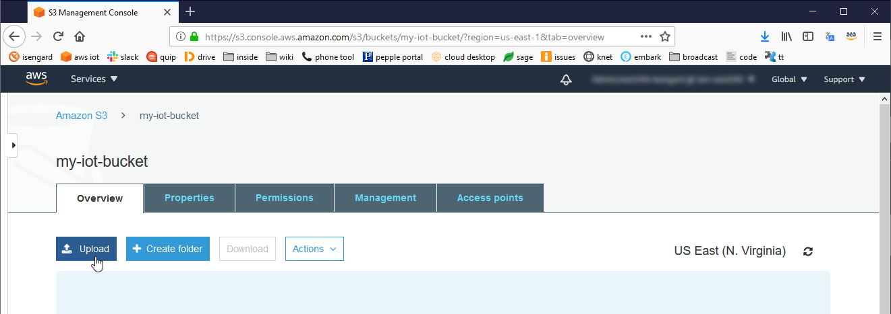

Select an OTA file, then click “Upload”.  We use an executable *helloworld* as an example.

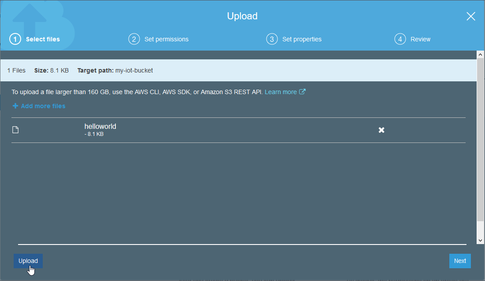

Now there is one file in the bucket.

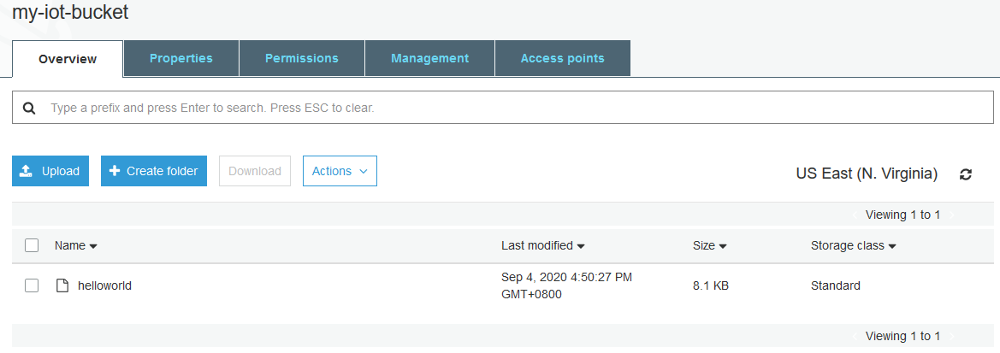

Create a pre-signed URL for the “helloworld” file. With the [pre-signed URL](https://docs.aws.amazon.com/sdk-for-go/v1/developer-guide/s3-example-presigned-urls.html), one can download the file even if you don’t open the S3 bucket to public domain. Run the following AWS CLI command to create a pre-signed URL that is valid for one day.

```bash
aws s3 presign s3://my-iot-bucket/helloworld --expires-in 86400
```

It will generate a URL in the output that looks like this:

```
https://my-iot-bucket.s3.amazonaws.com/helloworld?AWSAccessKeyId=xxxxxxxxxxxxxxxxxxxx&Signature=xxxxxxxxxxxxxxxxxxxxxxxxxxxx&Expires=1599706420
```

## Step 2 - Create a job

First, create a JSON document to describe what need to be executed for the job, and upload it to the S3 bucket.

Create a file named *“my-dl-job.json”* on the PC with the following content. Replace the URL with the one you’ve generated in Step 1.

```json
{
    "cmdToBeExecuted": "curl -C - 'https://my-iot-bucket.s3.amazonaws.com/helloworld?AWSAccessKeyId=xxxxxxxxxxxxxxxxxxxx&Signature=xxxxxxxxxxxxxxxxxxxxxxxxxxxx&Expires=1599706420' --output helloworld && chmod 777 helloworld && ./helloworld > log.txt"
}
```

The parameter `-C -` in "*curl*" command is used for resuming a previous file transfer.  You can check "[https://curl.haxx.se/docs/manpage.html](https://curl.haxx.se/docs/manpage.html)" for more information.

When you deploy the job, this JSON document will be sent to target devices over a reserved MQTT topic. Your code running on the device will receive it in a callback function registered by using [aws_iot_jobs_subscribe_to_job_messages](https://github.com/aws-samples/aws-iot-mqtt-download-agent/blob/master/include/aws_iot_jobs_interface.h) function of the AWS IoT Device SDK. The callback function parses this JSON document and put the value of ***“cmdToBeExecuted”*** in a *system()* call.

In the [AWS S3 console](https://console.aws.amazon.com/s3), go to the bucket named “*my-iot-bucket*”, which you’ve created in step #1.

- Click the name of the bucket
- Click **“Upload”**
- Select the *“my-dl-job.json”* file *on your local machine.*
- Click **“Upload”** and the file should appear in the bucket.

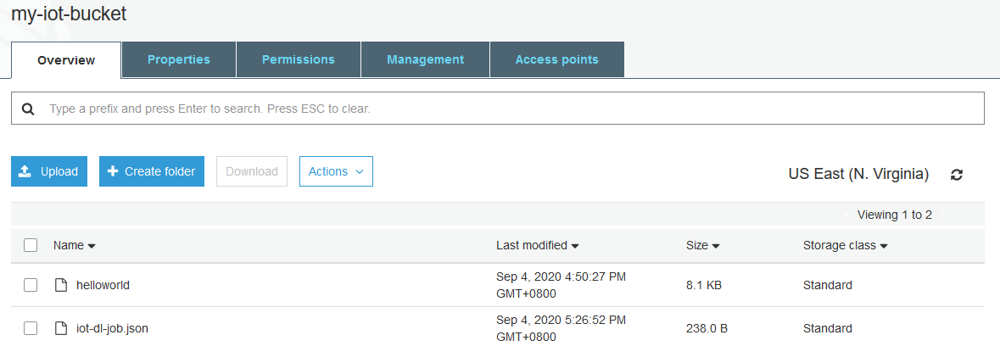

Go to [AWS IoT Core console](http://console.aws.amazon.com/iot) to create a job. In the IoT Core console, select “Manage”, “Jobs”, then select “Create a job”.

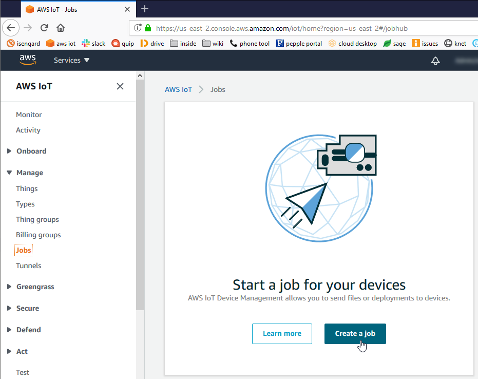

Select “Create custom job”.

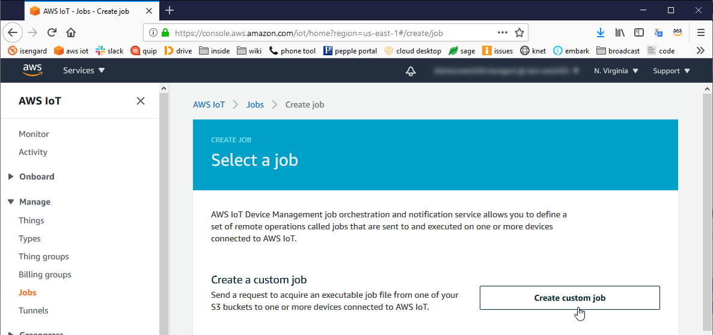

Input a Job ID, for example, “my-dl-job”. Select the target device that should receive the job. Select the job JSON document ***iot-dl-job.json***. Scroll down and click “Next”, then “Create”.

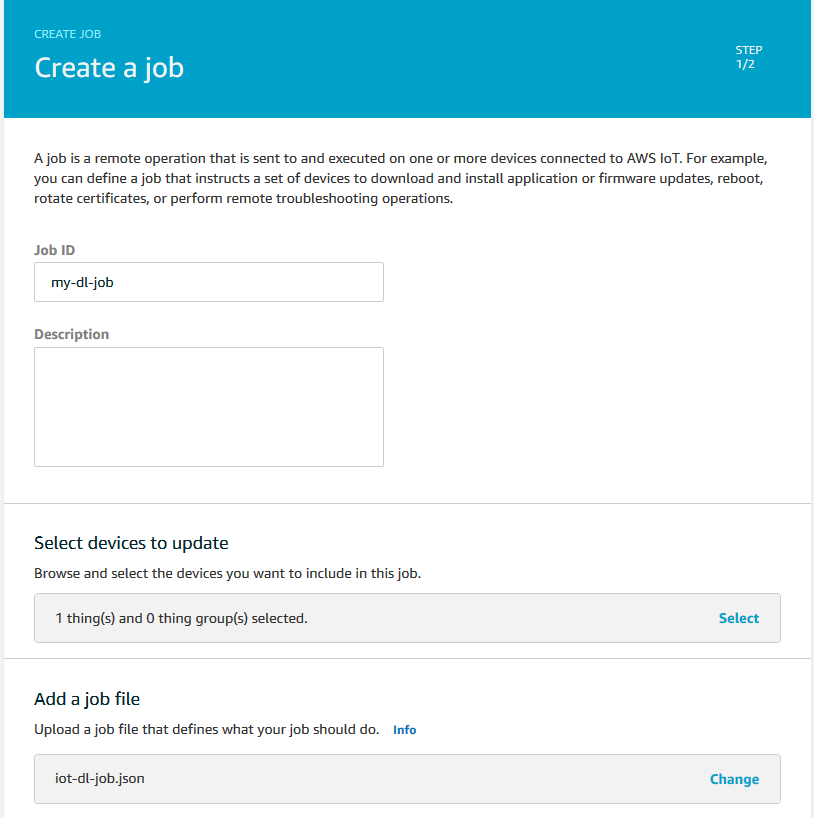

Now there is a job in the job list. You can come back to check its status later, after finishing step 3 below.

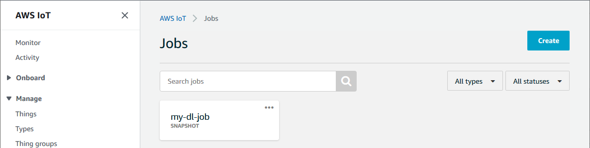

## Step 3 - Build and run the example app
Run below commands to get this project and related libraries.

```bash
$ git clone git@github.com:aws-samples/aws-iot-mqtt-download-agent.git
$ cd aws-iot-mqtt-download-agent
$ wget -qO- https://github.com/ARMmbed/mbedtls/archive/mbedtls-2.18.1.tar.gz | tar xvz -C external_libs/mbedTLS --strip-components=1
$ wget -qO- https://github.com/ARMmbed/mbed-crypto/archive/mbedcrypto-1.1.1.tar.gz | tar xvz -C external_libs/mbedTLS/crypto --strip-components=1
$ wget -qO- https://github.com/intel/tinycbor/archive/v0.5.2.tar.gz | tar xvz -C external_libs/tinycbor --strip-components=1
```

Go to folder `samples/linux/execute_cmd_jobs_sample/` , configure `aws_iot_config.h` .
```c
// Get from console
// =================================================
#define AWS_IOT_MQTT_HOST              "YOUR_ENDPOINT_HERE" ///< Customer specific MQTT HOST. The same will be used for Thing Shadow
#define AWS_IOT_MQTT_PORT              443 ///< default port for MQTT/S
#define AWS_IOT_MQTT_CLIENT_ID         "YOUR_CLIENT_ID" ///< MQTT client ID should be unique for every device
#define AWS_IOT_MY_THING_NAME          "YOUR_THING_NAME" ///< Thing Name of the Shadow this device is associated with
#define AWS_IOT_ROOT_CA_FILENAME       "rootCA.crt" ///< Root CA file name
#define AWS_IOT_CERTIFICATE_FILENAME   "cert.pem" ///< device signed certificate file name
#define AWS_IOT_PRIVATE_KEY_FILENAME   "privkey.pem" ///< Device private key filename
// =================================================
```

Build and execute this sample under folder `samples/linux/execute_cmd_jobs_sample/`
```bash
$ make
......

$ ./execute_cmd_job_sample
......
All the blocks are complete download.
Received final expected block of file.
......
Execute command: curl -C - 'https://my-iot-bucket.s3.amazonaws.com/helloworld?......' --output helloworld && chmod 777 helloworld && ./helloworld > log.txt
......
```

## Step 4 - Check the job execution status

If everything works, in the folder `samples/linux/execute_cmd_job_sample/` , there should be `helloworld` and `log.txt` files.

```bash
$ ls -l
total 668
-rwxrwxrwx    1 root     root        652368 Sep  4 09:49 execute_cmd_job_sample
-rwxrwxrwx    1 root     root          8332 Sep  4 09:52 helloworld
-rw-rw-rw-    1 root     root            37 Sep  4 09:52 log.txt

$ cat log.txt
Hello World!
```

You can also check the status of the job on the AWS IoT Job console.


# Use OpenSSL transport layer

In this Execute Command Job sample application it uses MbedTLS as its transport layer by default.  To change the transport layer to OpenSSL, you need to install OpenSSL library:

```bash
$ sudo apt-get update
$ sudo apt-get install libssl-dev
```

Build and specify openssl as its transport layer adapter.

```bash
$ make TLS_ADAPTER=openssl
TLS_ADAPTER=openssl
......
```

